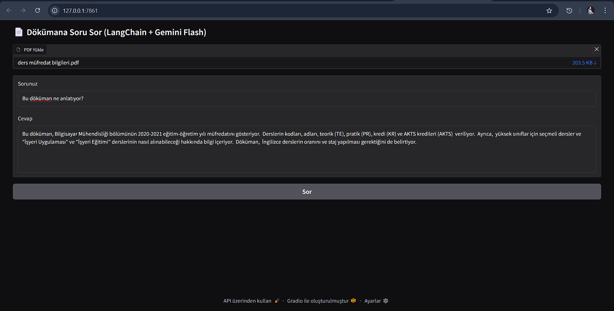

# LangChain Doküman Soru-Cevap Projesi

Bu proje, LangChain kullanarak PDF dokümanlar üzerinde doğal dilde soru sorabilmenizi sağlar. Google Gemini 2.5 Flash modelini kullanır ve Gradio ile basit bir web arayüzü sunar.

---

## Özellikler

- PDF dosyalarını yükleyip içeriklerini parçalara ayırma
- Gemini 2.5 Flash modeli ile doğal dil sorularını yanıtlama
- Gradio arayüzü ile kullanıcı dostu etkileşim
- `.env` dosyası olmadan API anahtarı kullanımına uygun yapı

## Uygulama Arayüzü
Aşağıda Gradio ile oluşturduğumuz uygulamanın ekran görüntüsü yer alıyor:


---

## Kurulum

```bash
pip install langchain gradio pypdf faiss-cpu


